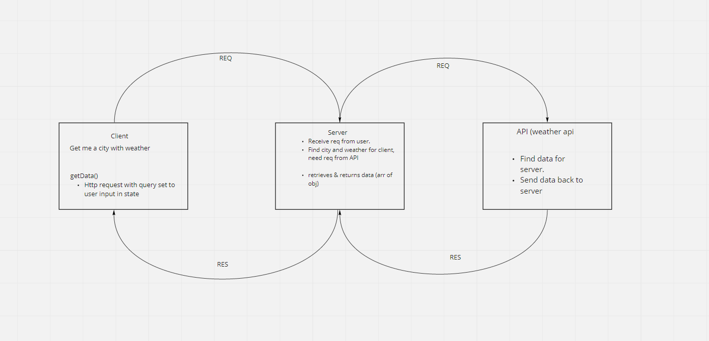

# City Explorer API

**Author**: Ryan Emmans
**Version**: 1.0.0
<!-- (increment the patch/fix version number if you make more commits past your first submission) -->

- - -

## ***Deploy Status:***

Status badge will go here.

## Overview
<!-- Provide a high level overview of what this application is and why you are building it, beyond the fact that it's an assignment for this class. (i.e. What's your problem domain?) -->

In this lab assignment, you will begin building your own custom API server, which will provide data for the City Explorer front-end application. This means users will get to see not only the map, but also interesting information about the area, provided by a variety of third-party APIs that your server will manage.

## Getting Started
<!-- What are the steps that a user must take in order to build this app on their own machine and get it running? -->

## Architecture
<!-- Provide a detailed description of the application design. What technologies (languages, libraries, etc) you're using, and any other relevant design information. -->
- [Node JS Docs](https://nodejs.org/en/)
- [NPM JS Docs](https://docs.npmjs.com/)
- [Express JS Docs](http://expressjs.com/en/4x/api.html)
- [dotenv Docs](https://www.npmjs.com/package/dotenv/)

## Change Log
<!-- Use this area to document the interactive changes made to your application as each feature is successfully implemented. Use time stamps. Here's an example:

01-01-2001 4:59pm - Application now has a fully-functional express server, with a GET route for the location resource. -->

08-24-2021 4:00pm - Completed setup of City Explorer API repository

## Credit and Collaborations
<!-- Give credit (and a link) to other people or resources that helped you build this application. -->

Collaborated with Kyle Cohen on MRRC diagram and outline.

### Additional Resources

- [Stack Overflow](https://stackoverflow.com/)
- [MDN Web Docs](https://developer.mozilla.org/en-US/)

- - -

### Class 07 Time Estimate

Name of feature: 1. Set up your server repository.

- Estimate of time needed to complete: 1 hour
- Start time: 2:45pm
- Finish time: 3:30pm
- Actual time needed to complete: 45 minutes

Name of feature: 2. Weather (placeholder): As a user of City Explorer, I want to see weather info for the city I searched, so that I know how to pack for an upcoming trip.

- Estimate of time needed to complete: 
- Start time: 
- Finish time: 
- Actual time needed to complete: 

Name of feature: 3. Errors (revisited): As a user, I want clear messages if something goes wrong so I know if I need to make any changes or try again in a different manner.

- Estimate of time needed to complete: 
- Start time: 
- Finish time: 
- Actual time needed to complete: 
